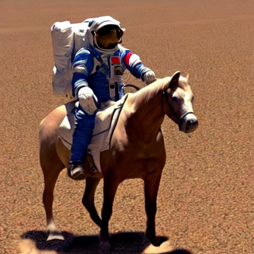

# Hello Stable Diffusion!

This is a repository for my basic implementation of the Stable Diffusion algorithm. It is a simple implementation of the algorithm, and is not optimized for speed. It is meant to be a simple implementation that is easy to understand and modify.

It is also designed to run on Apple Silicon (M1/M2) processors, and is not optimized for other architectures.

## Usage